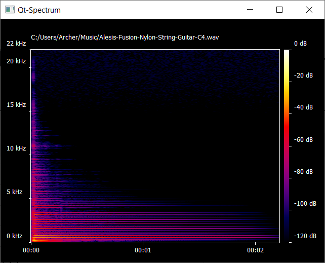

# Qt-Spectrum
 
Small projects for educational purpose only. This app can create live graphic for amplitude/frequency plots from your mircophone date, read wav files and create a amplitude/frequency plots. Also could draw a time depended spectrogram for music files. Cound use three different transformation inside( choosable in transformation menu ).
## Sceenshots

  

  

  

